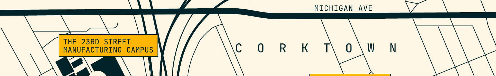

# Beacon Manufacturing
## Capabilities Statement

**beaconmfg.us** · Local Mfg. · 100% Onshore American Industry

---

Beacon is a builder-led contract manufacturer in Detroit delivering metal
fabrication, assembly, and rapid prototyping. From one-off prototypes to
repeatable short runs and full production. Bring us your manufacturing
challenges.

---

## Core Capabilities
*Fabrication · Assembly · Prototyping*

### Fabrication
*Cutting, forming, and welding for metal parts and structures.*

- **Laser cutting** tube + flat
- **Forming** - brake press, tube bending, punch & press
- **Welding** - MIG / TIG / laser + robotic
- **Short runs** - jigs & fixtures for repeatability

### Assembly
*Kitting, sub-assembly, full builds - and everything in between.*

- Kitting + sub-assembly + final assembly
- Complete build-ups with CAD / 3xD support
- Torque & fastener standards; EOL test
- Quality checks + rework when needed

### Prototyping & DigiFab
*Fast prototypes and fixtures, CAD to part.*

- **3D printing** - FDM, SLA, SLS (EOS)
- Quick jigs, check-fixtures, POCs, mockups
- Same-week iteration on form, fit, function

---

### Warehousing & Logistics
*Products in, products out - without the chaos.*

- Receiving, inventory, and part management
- Parcel + freight including no-box, roll-on / roll-off
- Flexible storage

---

### Location
*23rd Street Manufacturing Campus · Corktown, Detroit*

- **0.68 mi** to Michigan Central
- **1 mi** to Canada
- Adjacent to Michigan Ave and Newlab

---

## Have a part, kit, or assembly in mind?

Send a print, a CAD file, or a napkin sketch. We'll quote, prototype, and
put it on a line.

**beaconmfg.us** · 2050 15th St · Detroit, MI 48216

---

Beacon © 2026 - Local Mfg. 100% Onshore American Industry · Capabilities Statement
